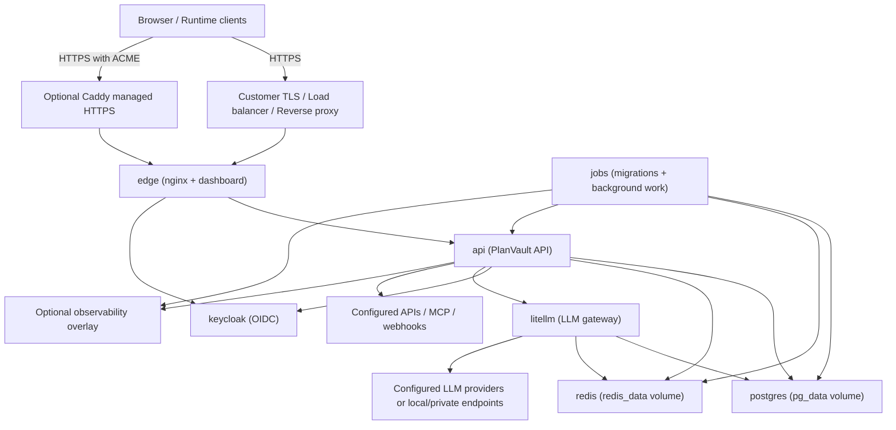

# Production Topology

This document describes the supported public self-hosted topology for
PlanVault: single-host Docker Compose in a customer-managed or VPC environment.

It is a reference for operators, security reviewers, and platform teams. It is
not a Kubernetes or multi-node HA guide.

## Supported Topology

## Stateful And Stateless Components

| Component | State | Notes |
|-----------|-------|-------|
| `postgres` | Stateful | Primary datastore for PlanVault, Keycloak, and LiteLLM databases. Backed by `pg_data`. |
| `redis` | Stateful cache/session support | Backed by `redis_data`; cache loss is recoverable but can affect latency and idempotency windows. |
| `keycloak` | Stateful via PostgreSQL | No separate host volume in this profile; realm import is rendered from `init/planvault-realm.json`. |
| `litellm` | Stateful via PostgreSQL/Redis | Routes model calls and stores LiteLLM metadata. |
| `api` | Stateless process with durable backing stores | Do not run migrations here. |
| `jobs` | Singleton worker | Sole Flyway owner and background worker. Do not scale above one replica. |
| `edge` / `edge-tls` | Stateless | Public entry point for base/direct TLS profiles. |
| Caddy overlay | Stateless proxy with cert state | Optional managed HTTPS overlay. Certificate/account state is stored in `caddy_data` / `caddy_config`. |
| Observability overlay | Stateful if enabled | Prometheus, Grafana, Loki, and Tempo use named volumes. For production retention, configure object storage for Loki/Tempo. |

## Trust Boundaries

| Boundary | What crosses it | Control |
|----------|-----------------|---------|
| Internet / customer network to `edge` or Caddy | Browser traffic, Runtime API calls, Keycloak browser flows | Customer TLS/ingress policy or Caddy ACME, `BASE_URL`, `CORS_ORIGINS`, `KC_PUBLIC_HOSTNAME`. |
| `edge` to private Docker network | HTTP proxy traffic to `api` and `keycloak` | Only `edge` publishes host ports by default. |
| Runtime to external tools | HTTP/OpenAPI tools, webhooks, MCP endpoints | Configure only trusted targets; use HTTPS where possible. |
| Runtime to model backends | LiteLLM calls to external providers or local/private endpoints | Provider credentials remain configured by the operator/org; prompts never receive plaintext secrets. |
| App to durable stores | PostgreSQL and Redis | Internal Docker network only; protect host volumes and backups. |
| App to observability | OTLP logs/traces/metrics when enabled | Use tenant-safe labels and avoid raw payload logging. |

## Volumes To Protect

| Volume | Service | Backup importance |
|--------|---------|-------------------|
| `pg_data` | `postgres` | Critical. Contains application data, Keycloak data, LiteLLM data, wrapped DEK metadata, audit/session data. |
| `redis_data` | `redis` | Important for cache/idempotency continuity; less critical than PostgreSQL. |
| `prometheus_data` | `prometheus` overlay | Optional monitoring history. |
| `grafana_data` | `grafana` overlay | Optional dashboards/settings state. |
| `loki_data` | `loki` overlay | Optional logs when filesystem storage is used. |
| `tempo_data` | `tempo` overlay | Optional traces when local storage is used. |
| `caddy_data` / `caddy_config` | Caddy overlay | Optional ACME account/certificate state when managed HTTPS is used. |

Also protect:

- `.env`
- `init/planvault-realm.json`
- TLS material under `./tls/`, if direct TLS is used
- any copied observability certificates under `observability/certs`

## Scaling Model

The public self-hosted Compose profile is designed as a single-host deployment.

| Service | Horizontal scaling in public profile |
|---------|--------------------------------------|
| `edge` | Not documented as a multi-replica target in this package. Put customer HA in front of the host if needed. |
| `api` | Not a supported multi-replica public profile without a validated topology. |
| `jobs` | Must remain one replica. |
| `postgres` | Bundled single instance. External HA PostgreSQL requires a separate enterprise deployment plan. |
| `redis` | Bundled single instance. External HA Redis requires a separate enterprise deployment plan. |

If you need multi-node HA, external managed databases, Kubernetes, or an offline
image mirror, treat it as an enterprise deployment design and validate install,
upgrade, backup, restore, and rollback before production use.

## Explicit Non-Goals For This Public Package

The public repository intentionally does not ship Helm charts, Docker Swarm
manifests, multi-node PostgreSQL/Redis HA, or offline mirror automation. Those
deployment models change the upgrade, backup, restore, identity, and support
contracts enough that they should be delivered as validated enterprise runbooks
rather than as small Compose toggles.

## Production Checklist

- Terminate TLS at your ingress, use the `direct_tls` profile, or use the Caddy
  overlay for simple managed HTTPS.
- Set `BASE_URL`, `PUBLIC_DOMAIN`, `CORS_ORIGINS`, `KC_PUBLIC_HOSTNAME`, and
  `KEYCLOAK_ISSUER` before exposing the stack.
- Run `scripts/render-keycloak-realm.sh` after URL or Keycloak client-secret changes.
- Verify image provenance with Cosign.
- Review the public SBOM manifest at <https://planvault.ai/sbom/manifest.json>.
- Back up `pg_data`, `.env`, and `init/planvault-realm.json`.
- Keep `jobs` at one replica.
- Keep `PLANVAULT_LOG_LLM_BODIES=false`.
- Enable the observability overlay if you need local Grafana/Prometheus/Loki/Tempo.
